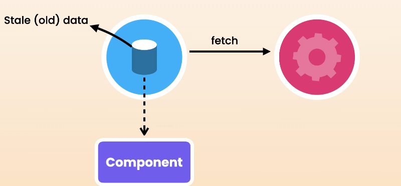
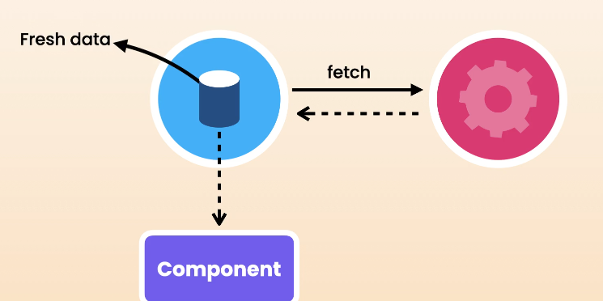

1. if the data is stale, react query will attempt to refetch the data in the background
2. Then it still using the cached data to render the UI
   
3. When the fresh data is fetched, react query will update the cache and re-render the UI with the fresh data
   
